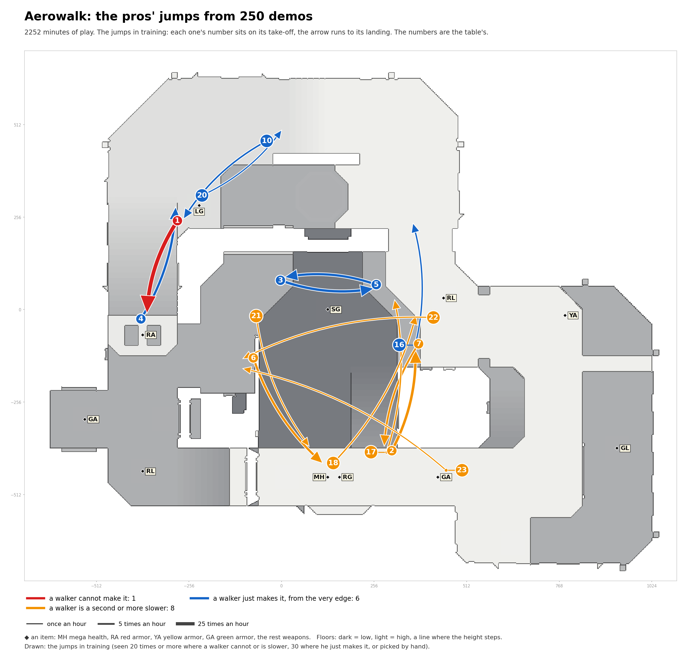
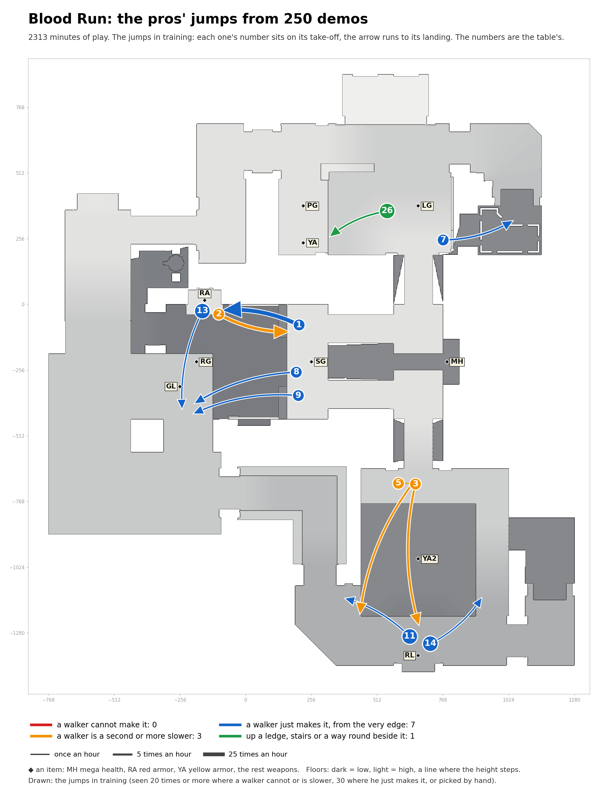
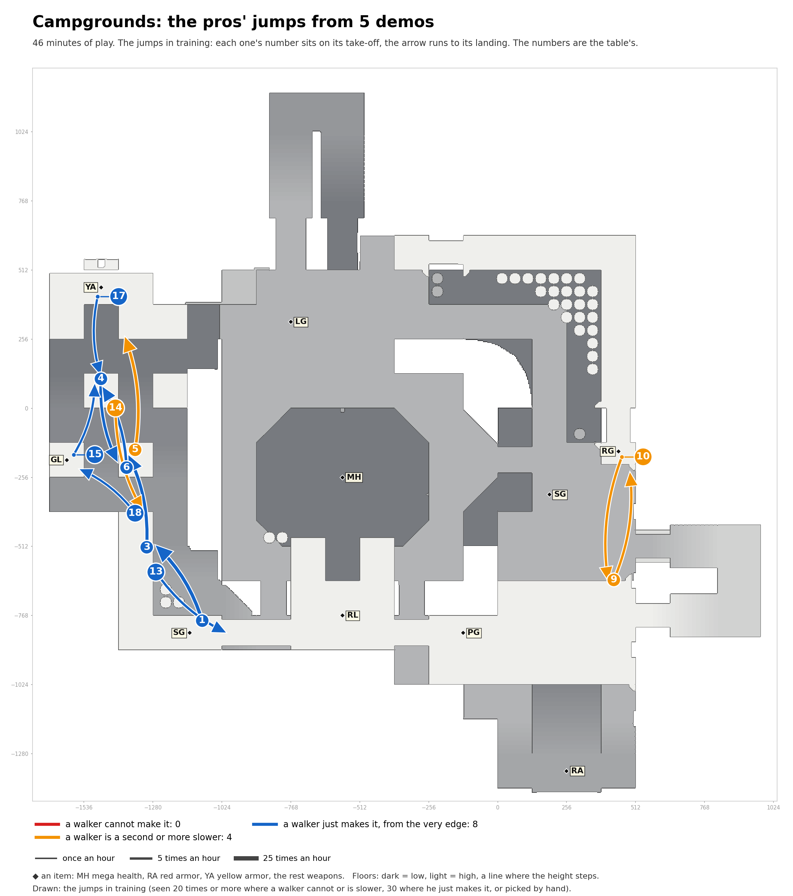

# The pros' jumps in training

A map a section: the picture (each jump's number sits on its take-off, the arrow runs to its landing) and the
list of its jumps. Red: a walker cannot make it. Orange: a walker is a second or more slower. Blue: a walker just
makes it, from the very edge. Green: up a ledge. The thicker the arrow, the more often the pros jump it.

Speed needed: running jump up to 340 units a second, circle jump up to 440, strafe jumps above.

## Aerowalk

| # | Name | Jump type | Times an hour |
|---|---|---|---|
| 1 | LG to RA | circle jump, onto a ledge 38 higher | 32.4 |
| 2 | RG to RL, heading north | circle jump | 13.1 |
| 3 | past SG to SG, heading east | running jump | 11.8 |
| 4 | RA to LG | circle jump | 10.0 |
| 5 | past SG to SG, heading west | running jump | 9.9 |
| 6 | past SG to MH, heading south-east | circle jump, 72 down | 8.2 |
| 7 | RL to RG | circle jump | 5.2 |
| 10 | past LG to LG | circle jump | 2.9 |
| 16 | RL to RL, heading north | strafe jumps (run-up) | 1.9 |
| 17 | RG to past RL | running jump, 233 down | 1.7 |
| 18 | RG to RL, heading north-east | circle jump, 233 down | 1.6 |
| 20 | LG to past LG | running jump | 1.0 |
| 21 | past SG to MH, heading south | circle jump, 72 down | 0.8 |
| 22 | RL to past SG | circle jump, 232 down | 0.8 |
| 23 | past RG to past SG | strafe jumps (run-up), 232 down | 0.5 |

## Blood Run

| # | Name | Jump type | Times an hour |
|---|---|---|---|
| 1 | SG to RA | circle jump | 27.3 |
| 2 | RA to SG | circle jump | 11.5 |
| 3 | past YA2 to RL | strafe jumps (run-up), 160 down | 4.3 |
| 5 | past YA2 to past RL | strafe jumps (run-up), 160 down | 3.6 |
| 7 | LG to past LG | circle jump | 2.0 |
| 8 | SG to GL, heading west | circle jump, 128 down | 1.8 |
| 9 | SG to GL, heading west | circle jump, 128 down | 1.4 |
| 11 | RL to past RL, heading north-west | circle jump | 1.1 |
| 13 | RA to GL | running jump, 128 down | 0.9 |
| 14 | RL to past RL, heading north-east | circle jump, onto a ledge 30 higher | 0.8 |
| 26 | past PG to YA | ledge jump (up 50) | 2.3 |

## Lost World

| # | Name | Jump type | Times an hour |
|---|---|---|---|
| 1 | past RA to past YA, heading east | circle jump, 68 down | 11.7 |
| 2 | past RL to past RA | circle jump | 7.3 |
| 3 | past YA to past RL | circle jump | 5.6 |
| 6 | open floor to past RL | circle jump | 3.6 |
| 7 | past GL to RA | circle jump | 3.3 |
| 9 | past YA2 to RA | circle jump, 184 down | 2.7 |
| 10 | past RL to past YA | circle jump | 2.4 |
| 11 | RA to past GL | circle jump | 2.4 |
| 12 | PG to past PG | circle jump | 2.3 |
| 14 | past RA to past YA, heading south-east | circle jump, 64 down | 1.7 |
| 15 | past RA to RA | circle jump | 1.5 |
| 16 | open floor to past YA | circle jump, 64 down | 1.5 |
| 17 | past YA to open floor, heading west | circle jump, onto a ledge 52 higher | 1.4 |
| 18 | RA to past RA | circle jump | 1.2 |
| 20 | past PG to PG | circle jump | 1.1 |
| 21 | RA to past RL | circle jump | 0.9 |
| 22 | past YA to open floor, heading north-west | running jump | 0.8 |
| 23 | past RA to past YA2 | strafe jumps (run-up) | 0.8 |
| 24 | open floor to YA | strafe jumps (run-up), 133 down | 0.5 |

## Sinister

| # | Name | Jump type | Times an hour |
|---|---|---|---|
| 1 | RA to past RA, heading south | circle jump | 16.7 |
| 2 | past RA to RA, heading north | circle jump | 13.7 |
| 4 | open floor to RA | circle jump | 8.4 |
| 7 | past MH to past MH, heading north | circle jump, onto a ledge 55 higher | 6.2 |
| 8 | RA to past RA, heading east | circle jump | 6.0 |
| 10 | past RA to RA, heading south-east | circle jump | 5.3 |
| 11 | past SG to past SG, heading south-west | strafe jumps (run-up) | 4.8 |
| 12 | past SG to past SG, heading east | circle jump | 4.7 |
| 13 | past RA to RA, heading south-west | circle jump | 4.2 |
| 14 | past RA to past RA, heading south-west | strafe jumps (run-up) | 4.2 |
| 16 | RA to past SG | strafe jumps (run-up), 223 down | 3.8 |
| 17 | open floor to past LG | circle jump | 3.7 |
| 18 | past LG to past LG, heading north | circle jump | 3.3 |
| 19 | past MH to past MH, heading north-west | circle jump | 2.8 |
| 20 | past RA to past RA, heading north-east | circle jump | 2.4 |
| 21 | past LG to past LG, heading west | circle jump | 2.2 |
| 22 | past RA to past RA, heading south-east | circle jump | 2.2 |
| 24 | SG to past LG | strafe jumps (run-up), 225 down | 2.0 |
| 25 | past YA2 to past RG | circle jump, 192 down | 1.8 |
| 26 | past RA to RA, heading north-west | circle jump | 1.8 |
| 27 | past RA to past RA, heading south-west | circle jump | 1.5 |
| 28 | YA2 to past RG, heading north-west | circle jump, 187 down | 1.4 |
| 29 | YA2 to past RG, heading west | circle jump, 188 down | 1.0 |
| 30 | past RA to RA, heading west | strafe jumps (run-up) | 1.0 |

## Furious Heights

| # | Name | Jump type | Times an hour |
|---|---|---|---|
| 2 | MH to past MH, heading south | circle jump | 15.8 |
| 5 | past MH to MH, heading north | circle jump | 12.9 |
| 6 | past RL to open floor | circle jump | 11.7 |
| 7 | MH to past MH, heading north-west | circle jump | 10.2 |
| 8 | past MH to MH, heading south-east | circle jump | 8.6 |
| 11 | open floor to open floor, heading north | circle jump | 6.1 |
| 14 | past YA2 to GL | circle jump | 4.5 |
| 16 | MH to MH, heading south | running jump | 3.1 |
| 18 | past LG to past LG, heading west | circle jump | 2.6 |
| 19 | past RL to RL, heading south-west | circle jump | 2.3 |
| 20 | RL to past RL | circle jump | 2.3 |
| 21 | past RL to RL, heading south | circle jump | 2.2 |
| 22 | open floor to open floor, heading east | running jump | 2.2 |
| 23 | past YA to past YA, heading east | circle jump | 2.2 |
| 24 | open floor to past PG | circle jump | 2.1 |
| 25 | past GL to open floor | circle jump | 1.8 |
| 26 | open floor to past RL | circle jump | 1.7 |
| 27 | MH to past MH, heading north | running jump | 1.6 |
| 28 | open floor to past LG | strafe jumps (run-up) | 1.3 |
| 29 | past RL to RL, heading west | strafe jumps (run-up) | 1.0 |

## Battleforged

| # | Name | Jump type | Times an hour |
|---|---|---|---|
| 1 | open floor to RA, heading east | circle jump, 64 down | 11.2 |
| 2 | past LG to past SG | circle jump | 3.8 |
| 3 | past SG to past LG | circle jump | 1.6 |
| 5 | open floor to RA, heading east | strafe jumps (run-up), 65 down | 1.5 |
| 6 | past GL to GL | circle jump | 1.4 |

## Campgrounds

| # | Name | Jump type | Times an hour |
|---|---|---|---|
| 1 | past SG to past GL | circle jump | 12.9 |
| 3 | past GL to GL, heading north | circle jump | 10.4 |
| 4 | past GL to GL, heading south | circle jump | 7.8 |
| 5 | past GL to YA | strafe jumps (run-up) | 7.8 |
| 6 | GL to past GL, heading north | circle jump | 6.5 |
| 9 | past RG to RG | strafe jumps (run-up) | 5.2 |
| 10 | RG to past RG | strafe jumps (run-up) | 5.2 |
| 13 | past SG to past SG, heading south-east | strafe jumps (run-up) | 5.2 |
| 14 | past GL to past GL, heading south | strafe jumps (run-up) | 5.2 |
| 15 | GL to past GL, heading north | circle jump | 3.9 |
| 17 | YA to past YA | circle jump | 3.9 |
| 18 | past GL to GL, heading north-west | circle jump | 3.9 |

## Cure

| # | Name | Jump type | Times an hour |
|---|---|---|---|
| 1 | past MH to MH | circle jump | 34.8 |
| 2 | MH to past MH | circle jump | 16.5 |
| 3 | open floor to past MH | circle jump | 11.0 |
| 4 | past MH to open floor | strafe jumps (run-up) | 10.4 |
| 5 | PG to YA | strafe jumps (run-up), 193 down | 7.1 |
| 7 | PG to past YA | circle jump, 65 down | 6.5 |
| 8 | past MH to past SG | strafe jumps (run-up) | 4.9 |
| 9 | past RL to RG, heading west | circle jump, 129 down | 3.1 |
| 11 | past RL to RG, heading south | circle jump | 2.5 |
| 12 | past SG to past MH | strafe jumps (run-up) | 2.1 |
| 13 | open floor to RL | circle jump, 192 down | 1.8 |
| 14 | open floor to MH | strafe jumps (run-up), 256 down | 1.7 |
| 15 | past GL to past RG | circle jump | 1.7 |

## Hektik

| # | Name | Jump type | Times an hour |
|---|---|---|---|
| 1 | GL to RA | circle jump | 27.0 |
| 2 | RL to RL, heading north | running jump | 24.4 |
| 3 | past LG to RA | circle jump | 19.3 |
| 4 | RA to past LG | circle jump | 14.5 |
| 5 | past GL to past LG | circle jump | 9.6 |
| 7 | RA to GL, heading north-west | circle jump | 5.5 |
| 8 | RA to GL, heading west | circle jump | 4.5 |
| 9 | YA to RL | circle jump | 2.7 |
| 10 | past RL to past LG | circle jump | 2.1 |
| 11 | LG to LG, heading south-east | circle jump | 2.0 |
| 12 | LG to past RA | circle jump | 1.9 |
| 13 | past RL to RL | circle jump | 1.9 |
| 14 | past GL to past GL, heading west | circle jump | 1.6 |
| 15 | RA to past GL | circle jump, 225 down | 1.1 |

## Toxicity

| # | Name | Jump type | Times an hour |
|---|---|---|---|
| 1 | RL to MH, heading east | running jump | 25.5 |
| 2 | MH to RL, heading west | circle jump | 13.0 |
| 3 | past PG to RG | circle jump, 72 down | 12.1 |
| 4 | RL to MH, heading east | circle jump | 7.3 |
| 5 | past RL to past RL, heading south | circle jump | 5.9 |
| 6 | past PG to past PG, heading south-east | running jump | 5.4 |
| 7 | past RG to past PG | running jump | 4.8 |
| 8 | MH to RL, heading west | circle jump | 3.9 |
| 10 | past RL to RL | circle jump | 2.7 |
| 12 | RL to past RL | circle jump | 2.4 |
| 13 | LG to LG, heading west | circle jump | 2.1 |
