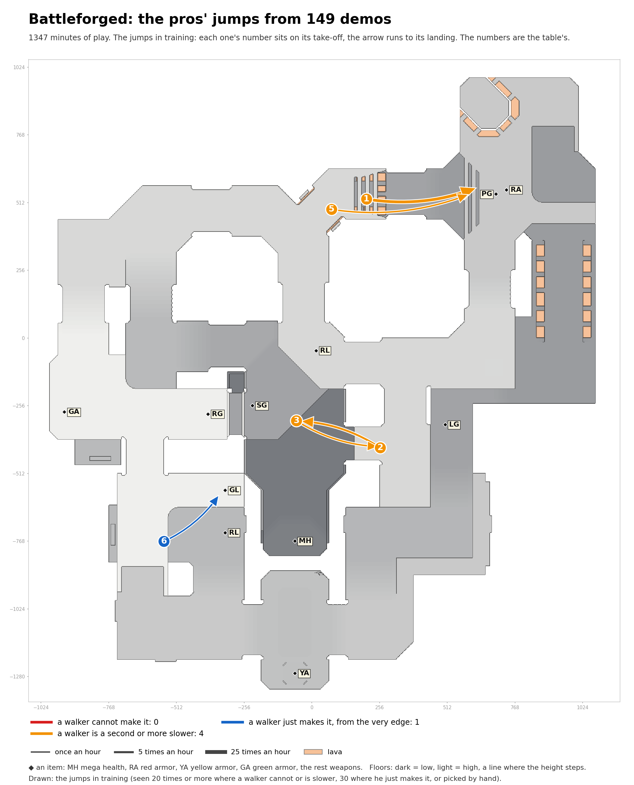

# Battleforged: the pros' jumps in training

Speed needed: running jump up to 340 units a second, circle jump up to 440, strafe jumps above.

| # | Name | Jump type | Times an hour |
|---|---|---|---|
| 1 | open floor to RA, heading east | circle jump, 64 down | 11.2 |
| 2 | past LG to past SG | circle jump | 3.8 |
| 3 | past SG to past LG | circle jump | 1.6 |
| 5 | open floor to RA, heading east | strafe jumps (run-up), 65 down | 1.5 |
| 6 | past GL to GL | circle jump | 1.4 |
