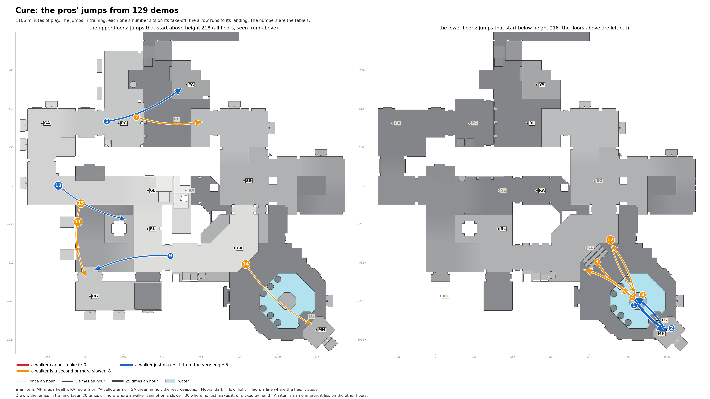

# Cure: the pros' jumps in training

Speed needed: running jump up to 340 units a second, circle jump up to 440, strafe jumps above.

| # | Name | Jump type | Times an hour |
|---|---|---|---|
| 1 | past MH to MH | circle jump | 34.8 |
| 2 | MH to past MH | circle jump | 16.5 |
| 3 | open floor to past MH | circle jump | 11.0 |
| 4 | past MH to open floor | strafe jumps (run-up) | 10.4 |
| 5 | PG to YA | strafe jumps (run-up), 193 down | 7.1 |
| 7 | PG to past YA | circle jump, 65 down | 6.5 |
| 8 | past MH to past SG | strafe jumps (run-up) | 4.9 |
| 9 | past RL to RG, heading west | circle jump, 129 down | 3.1 |
| 11 | past RL to RG, heading south | circle jump | 2.5 |
| 12 | past SG to past MH | strafe jumps (run-up) | 2.1 |
| 13 | open floor to RL | circle jump, 192 down | 1.8 |
| 14 | open floor to MH | strafe jumps (run-up), 256 down | 1.7 |
| 15 | past GL to past RG | circle jump | 1.7 |
