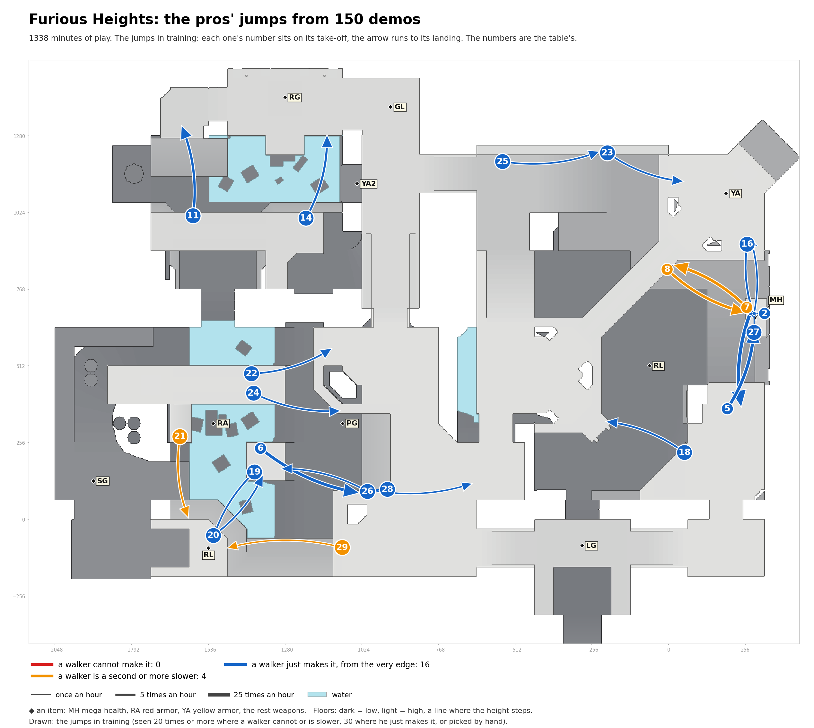

# Furious Heights: the pros' jumps in training

Speed needed: running jump up to 340 units a second, circle jump up to 440, strafe jumps above.

| # | Name | Jump type | Times an hour |
|---|---|---|---|
| 2 | MH to past MH, heading south | circle jump | 15.8 |
| 5 | past MH to MH, heading north | circle jump | 12.9 |
| 6 | past RL to open floor | circle jump | 11.7 |
| 7 | MH to past MH, heading north-west | circle jump | 10.2 |
| 8 | past MH to MH, heading south-east | circle jump | 8.6 |
| 11 | open floor to open floor, heading north | circle jump | 6.1 |
| 14 | past YA2 to GL | circle jump | 4.5 |
| 16 | MH to MH, heading south | running jump | 3.1 |
| 18 | past LG to past LG, heading west | circle jump | 2.6 |
| 19 | past RL to RL, heading south-west | circle jump | 2.3 |
| 20 | RL to past RL | circle jump | 2.3 |
| 21 | past RL to RL, heading south | circle jump | 2.2 |
| 22 | open floor to open floor, heading east | running jump | 2.2 |
| 23 | past YA to past YA, heading east | circle jump | 2.2 |
| 24 | open floor to past PG | circle jump | 2.1 |
| 25 | past GL to open floor | circle jump | 1.8 |
| 26 | open floor to past RL | circle jump | 1.7 |
| 27 | MH to past MH, heading north | running jump | 1.6 |
| 28 | open floor to past LG | strafe jumps (run-up) | 1.3 |
| 29 | past RL to RL, heading west | strafe jumps (run-up) | 1.0 |
