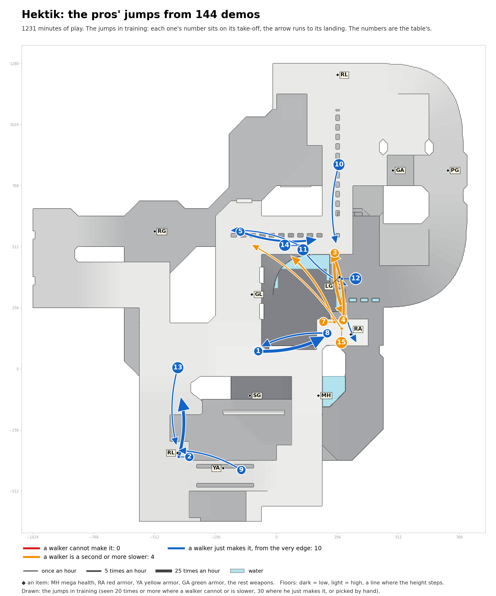

# Hektik: the pros' jumps in training

Speed needed: running jump up to 340 units a second, circle jump up to 440, strafe jumps above.

| # | Name | Jump type | Times an hour |
|---|---|---|---|
| 1 | GL to RA | circle jump | 27.0 |
| 2 | RL to RL, heading north | running jump | 24.4 |
| 3 | past LG to RA | circle jump | 19.3 |
| 4 | RA to past LG | circle jump | 14.5 |
| 5 | past GL to past LG | circle jump | 9.6 |
| 7 | RA to GL, heading north-west | circle jump | 5.5 |
| 8 | RA to GL, heading west | circle jump | 4.5 |
| 9 | YA to RL | circle jump | 2.7 |
| 10 | past RL to past LG | circle jump | 2.1 |
| 11 | LG to LG, heading south-east | circle jump | 2.0 |
| 12 | LG to past RA | circle jump | 1.9 |
| 13 | past RL to RL | circle jump | 1.9 |
| 14 | past GL to past GL, heading west | circle jump | 1.6 |
| 15 | RA to past GL | circle jump, 225 down | 1.1 |
