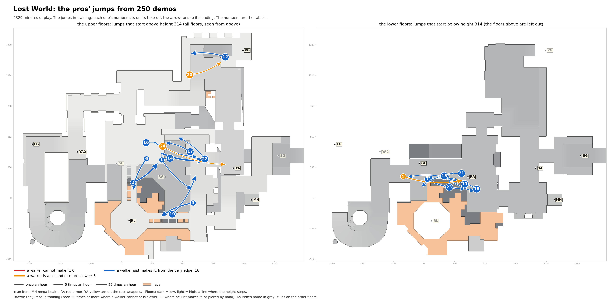

# Lost World: the pros' jumps in training

Speed needed: running jump up to 340 units a second, circle jump up to 440, strafe jumps above.

| # | Name | Jump type | Times an hour |
|---|---|---|---|
| 1 | past RA to past YA, heading east | circle jump, 68 down | 11.7 |
| 2 | past RL to past RA | circle jump | 7.3 |
| 3 | past YA to past RL | circle jump | 5.6 |
| 6 | open floor to past RL | circle jump | 3.6 |
| 7 | past GL to RA | circle jump | 3.3 |
| 9 | past YA2 to RA | circle jump, 184 down | 2.7 |
| 10 | past RL to past YA | circle jump | 2.4 |
| 11 | RA to past GL | circle jump | 2.4 |
| 12 | PG to past PG | circle jump | 2.3 |
| 14 | past RA to past YA, heading south-east | circle jump, 64 down | 1.7 |
| 15 | past RA to RA | circle jump | 1.5 |
| 16 | open floor to past YA | circle jump, 64 down | 1.5 |
| 17 | past YA to open floor, heading west | circle jump, onto a ledge 52 higher | 1.4 |
| 18 | RA to past RA | circle jump | 1.2 |
| 20 | past PG to PG | circle jump | 1.1 |
| 21 | RA to past RL | circle jump | 0.9 |
| 22 | past YA to open floor, heading north-west | running jump | 0.8 |
| 23 | past RA to past YA2 | strafe jumps (run-up) | 0.8 |
| 24 | open floor to YA | strafe jumps (run-up), 133 down | 0.5 |
