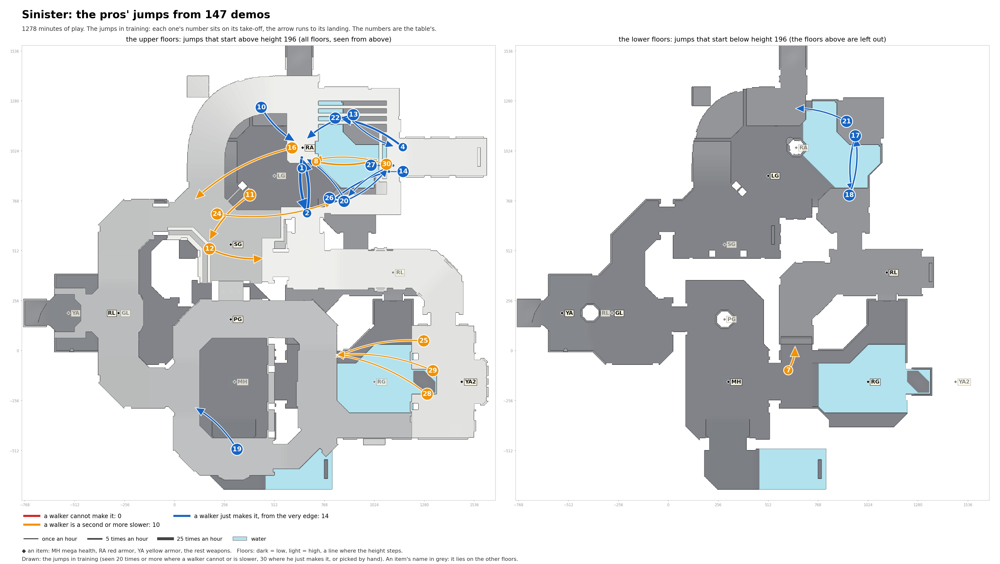

# Sinister: the pros' jumps in training

Speed needed: running jump up to 340 units a second, circle jump up to 440, strafe jumps above.

| # | Name | Jump type | Times an hour |
|---|---|---|---|
| 1 | RA to past RA, heading south | circle jump | 16.7 |
| 2 | past RA to RA, heading north | circle jump | 13.7 |
| 4 | open floor to RA | circle jump | 8.4 |
| 7 | past MH to past MH, heading north | circle jump, onto a ledge 55 higher | 6.2 |
| 8 | RA to past RA, heading east | circle jump | 6.0 |
| 10 | past RA to RA, heading south-east | circle jump | 5.3 |
| 11 | past SG to past SG, heading south-west | strafe jumps (run-up) | 4.8 |
| 12 | past SG to past SG, heading east | circle jump | 4.7 |
| 13 | past RA to RA, heading south-west | circle jump | 4.2 |
| 14 | past RA to past RA, heading south-west | strafe jumps (run-up) | 4.2 |
| 16 | RA to past SG | strafe jumps (run-up), 223 down | 3.8 |
| 17 | open floor to past LG | circle jump | 3.7 |
| 18 | past LG to past LG, heading north | circle jump | 3.3 |
| 19 | past MH to past MH, heading north-west | circle jump | 2.8 |
| 20 | past RA to past RA, heading north-east | circle jump | 2.4 |
| 21 | past LG to past LG, heading west | circle jump | 2.2 |
| 22 | past RA to past RA, heading south-east | circle jump | 2.2 |
| 24 | SG to past LG | strafe jumps (run-up), 225 down | 2.0 |
| 25 | past YA2 to past RG | circle jump, 192 down | 1.8 |
| 26 | past RA to RA, heading north-west | circle jump | 1.8 |
| 27 | past RA to past RA, heading south-west | circle jump | 1.5 |
| 28 | YA2 to past RG, heading north-west | circle jump, 187 down | 1.4 |
| 29 | YA2 to past RG, heading west | circle jump, 188 down | 1.0 |
| 30 | past RA to RA, heading west | strafe jumps (run-up) | 1.0 |
