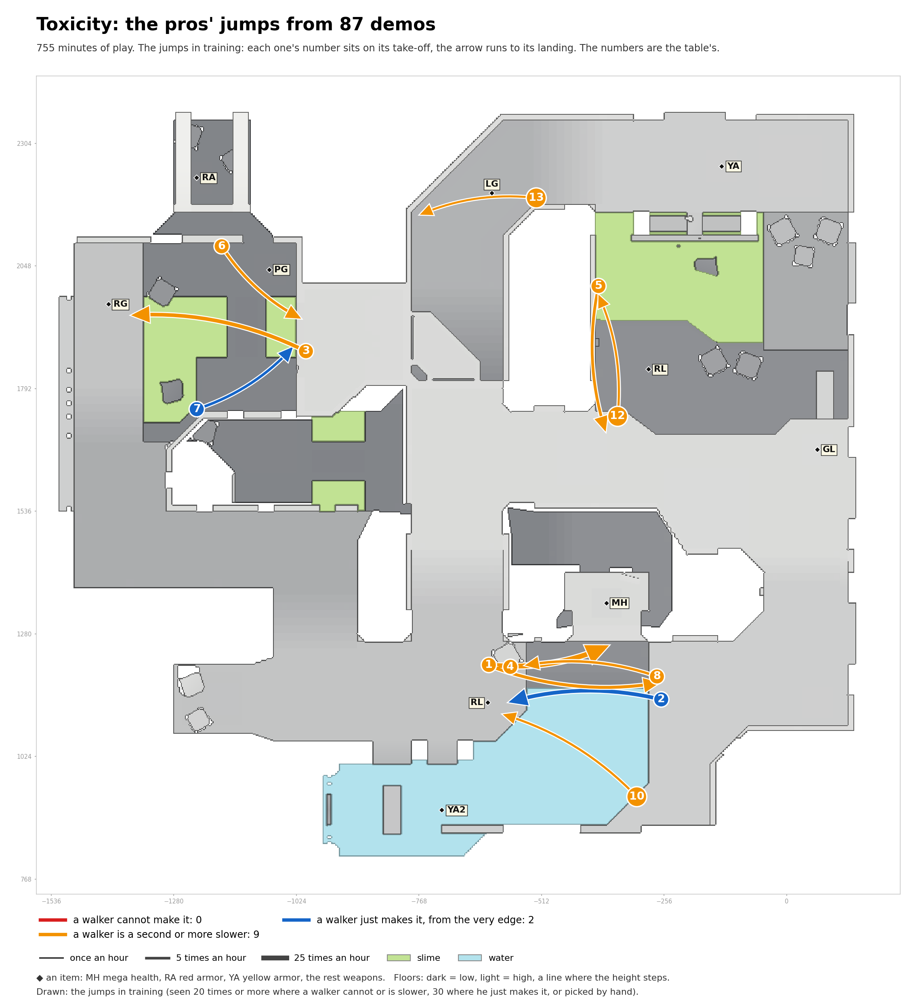

# Toxicity: the pros' jumps in training

Speed needed: running jump up to 340 units a second, circle jump up to 440, strafe jumps above.

| # | Name | Jump type | Times an hour |
|---|---|---|---|
| 1 | RL to MH, heading east | running jump | 25.5 |
| 2 | MH to RL, heading west | circle jump | 13.0 |
| 3 | past PG to RG | circle jump, 72 down | 12.1 |
| 4 | RL to MH, heading east | circle jump | 7.3 |
| 5 | past RL to past RL, heading south | circle jump | 5.9 |
| 6 | past PG to past PG, heading south-east | running jump | 5.4 |
| 7 | past RG to past PG | running jump | 4.8 |
| 8 | MH to RL, heading west | circle jump | 3.9 |
| 10 | past RL to RL | circle jump | 2.7 |
| 12 | RL to past RL | circle jump | 2.4 |
| 13 | LG to LG, heading west | circle jump | 2.1 |
